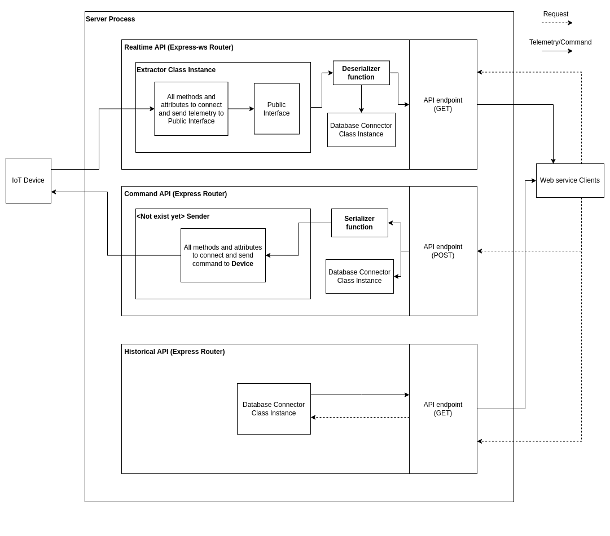

# Telemetry API

_Telemetry API_ is responsible for ingesting the telemetry from different kinds of sources and serve the telemetry to the API.

## Features

- Provide realtime telemetry WebSocket API to clients, implemented using [express-ws].
- Provide historical telemetry RESTful API to clients, implemented using [express].
- User defined Deserializer.
- Support logging, need to implement the Database Connector to desired database. Currently, there is only [Cassandra] Connector.
- Scripts and API service to connect with [OpenMCT].

## Installation

_Telemetry Server_ requires [Node.js](https://nodejs.org/) v16.13+ to run.

Clone the repository and install the dependencies

```sh
git clone https://github.com/N-Chaiyatorn/telemetry_server.git
cd telemetry_server
npm install
```

## Diagram



## Usage with OpenMCT

To use this _Telemetry Server_ with NASA's OpenMCT, first you need to clone this [forked version] of the OpenMCT. This version contain four custom plugins which are **_HistoricalTelemetry_**, **_RealtmeTelemetry_**, **_fprimeObject_** and **_satelliteObject_**.

The **_satelliteObject_** and **_fprimeObject_** plugin responsible for populate the telemetry point in OpenMCT and _need metadata file to work_.

The **_RealtmeTelemetry_** and **_HistoricalTelemetry_** plugin responsible for sending the telemetry to the telemetry point generated by **_satelliteObject_** and **_fprimeObject_**.

The fprimeObject metadata files is generated from the Fprime Dictionary, which I will explain how to get this file later. You can see example in `src/metadata/raw/RefDictionary.json`. After you get Fprime Dictionary, you can run

```sh
npm run configure:fprime <Target name>
```

This will generate new metadata files for **_fprimeObject_** plugin to `src/metadata/openmct/fprimeMetadata/<Target name>/` directory. Then you move these files to `<OpenMCT Root>/src/plugins/fprimeObject/metadata/` in OpenMCT project.

The satelliteObject metadata file is manually create from the user, which need to follow the specified structure. You can see the example in `src/metadata/raw/developmentSatelliteDictionary.json`.

```sh
npm run configure:satellite <Target name>
```

This will generate new metadata files for **_satelliteObject_** plugin to `src/metadata/openmct/<Target name>/` directory. Then you need to move these files to `<OpenMCT Root>/src/plugins/satelliteObject/metadata/` in OpenMCT project.

After the metadata is already generated and moved to the OpenMCT plugin, you can set up the WebSocket API route using `src/api/openmctRealtimeAPI.js` which execute in `src/server.js` (Fprime-gds Ref example is in there).

## Get the raw Fprime JSON metadata

This section will walk you through the steps to get the raw Fprime JSON metadata (e.g. `src/metadata/raw/RefDictionary.json`).

1. Clone the [Fprime] repository.
2. Create python virtual environment and get into that environment, then run
   ```sh
   pip install --upgrade fprime-tools fprime-gds
   cd Ref
   fprime-util generate
   fprime-util build --jobs "$(nproc || printf '%s\n' 1)"
   ```
   After finish, copy `<fprime root>/Autocoders/Python/src/fprime_ac/` directory into virtual environment `lib` directory.
   (This step is not mandatory, but I strongly suggest you to do this since the JSON metadata script need local python package (fprime_ac) to run, which cannot be installed/removed using pip.).
3. You **must** use _fprime_ prior to version 3.0.0 to get the JSON Fprime metadata, below is example command to rollback the fprime to version 2.1.0 (commit hash: af37cc4).
   ```sh
   git checkout af37cc4
   ```
4. Before running the JSON generator script, you must modify line 115 to line 121 in `<fprime root>/Autocoders/Python/bin/JSONDictionaryGen.py` file from
   ```python
   if not opts.build_root_overwrite is None:
        set_build_roots(opts.build_root_overwrite)
    else:
        if ("BUILD_ROOT" in os.environ.keys()) is False:
            print("ERROR: Build root not set to root build path...")
            sys.exit(-1)
        set_build_roots(os.environ["BUILD_ROOT"])
   ```
   to
   ```python
   try:
        set_build_roots(opts.build_root_overwrite)
    except:
        if ("BUILD_ROOT" in os.environ.keys()) == False:
            print("ERROR: Build root not set to root build path...")
            sys.exit(-1)
        set_build_roots(os.environ["BUILD_ROOT"])
   ```
5. Finally, you can generate the Fprime JSON metadata running
   ```sh
   <fprime root>/Autocoders/Python/bin/run_JSONDict.sh <path to TopologyAppAi.xml>
   ```
   below is the example command to get the Ref metadata in my local machine.
   ```sh
   ~/fprime/Autocoders/Python/bin/run_JSONDict.sh ~/fprime/Ref/Top/RefTopologyAppAi.xml
   ```

## Custom Realtime API Set up

To run this project as your requirements, you need to properly set up as follows

1. Implement your own connecting method in the Extractor class (If exist method is not compatible with your use case).
2. Implement your Deserializer in `/src/Classes/Deserializer/` (If exist Deserializer is not compatible with your use case).
3. Implement your Database Connector in `/src/Classes/DatabaseConnector/` (If exist Deserializer is not compatible with your use case).
4. Implement your express router to response to the request as you want.
5. Create instances of all classes mentioned above and pass the **Extractor** , **Deserializer** (if deserialization is needed), and **DatabaseConnector** (if logging is needed) to the router in `src/server.js`.
6. Start the server.

> Once started, the Extractor will try to connect to the configured endpoint. If success, it will retrives the telemetry and ready to serve to the clients.

[//]: # "References"
[node.js]: http://nodejs.org
[express]: http://expressjs.com
[openmct]: https://github.com/nasa/openmct
[cassandra]: https://cassandra.apache.org/_/index.html
[express-ws]: https://github.com/HenningM/express-ws
[ws]: https://github.com/websockets/ws
[cassandra-nodejs-driver]: https://github.com/datastax/nodejs-driver
[node-serialport]: https://github.com/serialport/node-serialport
[forked version]: https://github.com/N-Chaiyatorn/openmct
[fprime]: https://github.com/nasa/fprime
